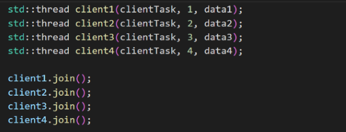

# Паралелен merge sort

## Общ преглед

Проектът се състои от клиент-сървър модел на C++, който извършва еднопоточно и
многопоточно сортиране на данни, получени от няколко клиента, с merge sort.
Резултатът се връща на клиента заедно с време за сравнение между двата подхода.

## Компоненти

1. Клиент (client.cpp)
    - Свързва се със сървъра.
    - Изпраща масив от цели числа за сортиране.
    - Показва сортираните данни заедно с времената за изпълнение на еднопоточния и
       многопоточния подход.
2. Сървър (server.cpp)
    - Обработва заявките на клиентите чрез сортиране на данните еднопоточно и
       многопоточно.
    - Връща резултатите и времената за изпълнение.

## Клиент

Работен процес

1. **Инициализация** :
    - Инициализира Winsock.
    - Създава сокет и се свързва със сървъра.
2. **Предаване на данни** :
    - Изпраща размера на масива и самия масив към сървъра.
3. **Получаване на отговор** :
    - Получава сортираните данни, времето за сортиране с една нишка и
       времето за сортиране с множество нишки.
4. **Изход** :
    - Показва сортираните данни и времената за изпълнение на двата подхода.

Функции

- **clientTask** : Управлява връзката и комуникацията със сървъра.

Примерна употреба

Функцията main създава няколко нишки за различни набори от данни, за да симулира
паралелни клиенти:

## Сървър

Работен процес

1. **Инициализация** :
    - Инициализира Winsock.
    - Създава и свързва сокет към порт 8080.
    - Изчаква входящи клиентски връзки.
2. **Обработка на клиенти** :
    - Приема входящи клиентски връзки.
    - Обработва всяка клиентска заявка в отделна нишка.
3. **Сортиране** :
    - Използва еднопоточен и многопоточен merge sort.
    - Измерва времето за изпълнение и на двата метода.
4. **Изпращане на отговор** :
    - Изпраща времената за изпълнение и сортираните данни обратно на
       клиента.
5. **Изход:**  
    При стартиране сървърът показва:  
    

Функции

- **merge** : Слива два сортирани подмасива.
- **mergeSortSingleThread** : Реализира еднопоточен merge sort.
- **mergeSortMultiThread** : Реализира многопоточен merge sort, ограничавайки
    нишките до броя на логическите ядра, за да гарантира, че всички ресурси се
    използват оптимално без излишно претоварване.
- **handleClient** : Управлява комуникацията със свързания клиент.

## Комуникация

1. **От клиент към сървър** :
    - Изпраща:
       - size: Броя на елементите в масива.
       - data: Масива от цели числа.
2. **От сървър към клиент** :
    - Изпраща:
       - singleThreadTime: Времето за сортиране с една нишка (в
          милисекунди).
       - multiThreadTime: Времето за сортиране с множество нишки (в
          милисекунди).
       - sortedData: Сортирания масив.

## Примерни сценарии

1. **Сценарий 1** :
    - **Вход** : []
    - **Изход** :
       - **Сортирани данни** : []
       - **Време с една нишка** : 0 ms
       - **Време с множество нишки** : 0 ms
2. **Сценарий 2** :
    - **Вход** : [23, 34, 27, 10, 2, 3, 47, 85, 37, 27]
    - **Изход** :
       - **Сортирани данни** : [2, 3, 10, 23, 27, 27, 34, 37, 47, 85]
       - **Време с една нишка** : X ms
       - **Време с множество нишки** : Y ms
3. **Сценарий 3** :
    - **Вход** : [99, -88, -77, 66, 55]
    - **Изход** :
       - **Сортирани данни** : [-88, -77, 55, 66, 99]
       - **Време с една нишка** : X ms
       - **Време с множество нишки** : Y ms

## Забележки

- Уверете се, че сървърът е стартиран преди клиента.
- Приложението предполага локален адрес на сървъра (127.0.0.1) и порт 8080.
- Ефективността на многопоточния алгоритъм зависи от размера на набора от
    данни и хардуерната конкуренция.

